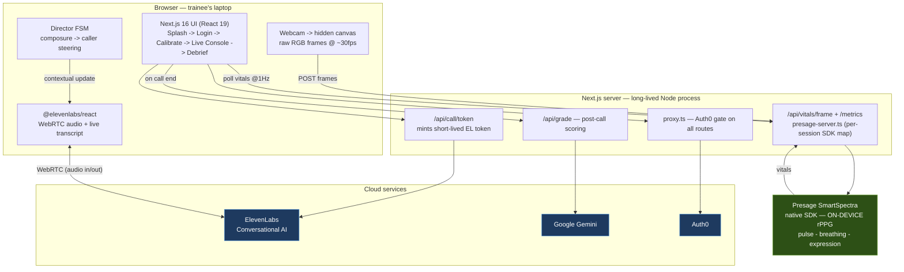

# Dispatchlingo

Real-time, high-stakes 911 dispatcher conversation trainer. 

## Tech stack

| Layer | Tech |
|---|---|
| **Frontend** | Next.js 16 (App Router), React 19, TypeScript, custom design-system CSS |
| **Voice AI (cloud)** | ElevenLabs Conversational AI — `@elevenlabs/react`, WebRTC, one agent per scenario |
| **Grading AI (cloud)** | Google Gemini — `@google/genai`, structured-JSON scoring |
| **Vitals AI (on-device)** | Presage SmartSpectra — `@smartspectra/node-sdk`, native-FFI rPPG from the webcam |
| **Auth** | Auth0 — `@auth0/nextjs-auth0` v4, enforced in `src/proxy.ts` (Next 16's renamed middleware) |
| **Runtime** | Long-lived Node process; per-session state held in-memory on `globalThis` |
| **Resilience** | Every AI path degrades to a scripted **sim mode** when its key is absent — demoable with zero keys |

## Architecture



**Key flows:** voice audio goes **browser ↔ ElevenLabs directly over WebRTC** (the server only mints the token, never touches audio); vitals go **webcam → server → local Presage SDK → polled back at 1 Hz**; the **director** loop reads the trainee's live composure from vitals and nudges the caller's panic mid-call; at hang-up the transcript + incident form go to **Gemini** for grading.

## Run it

```bash
cd app
npm install
npm run dev
```

Opens at http://localhost:3000. With no environment variables set, it runs entirely in **sim mode**: a scripted demo call (street assault scenario), simulated vitals, no login required — fully demoable with zero API keys.

## Going live

Copy `app/.env.example` to `app/.env.local` and fill in:

- **ElevenLabs** — `ELEVENLABS_API_KEY` + `ELEVENLABS_AGENT_ID`. One agent handles every scenario; persona, first message, and TTS settings are sent per-scenario via `overrides` at call start (`src/lib/scenarios.ts`, `src/hooks/useSession.ts`). On that agent in the ElevenLabs dashboard, enable prompt + first-message overrides under Security. Real calls run over WebRTC through `@elevenlabs/react`.
- **Presage SmartSpectra** — `PRESAGE_API_KEY`. There's no browser SDK (it's native-FFI/headless-only, `@smartspectra/node-sdk`), so the browser captures webcam frames to a hidden canvas and streams raw RGB to `/api/vitals/frame`; `src/lib/presage-server.ts` runs a persistent per-session SDK instance and decodes real pulse rate, breathing rate, and facial-expression tension. Get a key at https://smartspectra.presagetech.com/. This requires API routes to run in one long-lived Node process (`next start`, not a cold-start-per-request serverless deploy).
- **Auth0** — `AUTH0_DOMAIN` / `AUTH0_CLIENT_ID` / `AUTH0_CLIENT_SECRET` / `AUTH0_SECRET` / `APP_BASE_URL`, plus `NEXT_PUBLIC_AUTH_ENABLED=true`. Handled by `@auth0/nextjs-auth0` (`src/lib/auth0.ts`, `src/proxy.ts`). The login screen (`src/components/LoginScreen.tsx`) offers email/password and Google, and — once enabled in the Auth0 dashboard under Authentication -> Social/Enterprise/Passwordless — SSO and passwordless email too, all via Auth0 Universal Login. It always also offers **Try the demo — no login**, a guest bypass. Leaving `NEXT_PUBLIC_AUTH_ENABLED=false` (the default) skips the login screen entirely and drops straight into guest mode.

Any of these can be configured independently — e.g. real vitals with the scripted demo caller, or a real call with simulated vitals. Missing either key falls back cleanly to its sim path with no code changes needed.

## Structure

- `app/` — Next.js 16 app (App Router, TypeScript). `src/hooks/useSession.ts` is the session orchestrator; `src/hooks/usePresageVitals.ts` is the webcam-capture/metrics-poll client; `src/lib/` holds the pure logic (composure scoring, director FSM, report builder, scenarios, `presage-server.ts`).
- `design/` — imported Claude Design source (`Codeblue.dc.html` + `styles.css`), the UI contract the app's components are ported from.
- `docs/PRD.md` — full product requirements doc.
